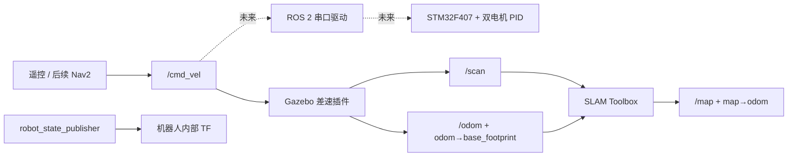

# OpenRobot-One

OpenRobot-One 是基于 ROS 2 Humble 的低成本差速移动机器人双轨 MVP。
仿真轨使用 Gazebo Classic、SLAM Toolbox、AMCL 和 Nav2；真机轨计划使用
ROS 2 串口驱动、STM32F407、双电机 PID 和编码器里程计。两条轨道共用
`/cmd_vel`、`/odom`、`/tf`、`/joint_states` 和 `/scan` 等标准接口。

采用双轨 MVP 的原因是先在可复现的仿真中验证模型、TF、感知和建图，再把相同
上层接口接到真机底盘。这样能把导航问题和电机、串口、供电问题分开定位，同时
避免维护两套上层软件。

## 系统架构



## 第一周完成度

- [x] 7 个最小 ROS 2 包和 Docker 开发环境
- [x] GitHub Actions、rosdep、colcon 构建与测试入口
- [x] 参数化 URDF/Xacro 和 RViz 配置
- [x] Gazebo 差速驱动、`/odom`、`/joint_states` 和 TF
- [x] CPU `ray` 二维雷达：360 点、10 Hz、0.12–8.0 m、`laser_link`
- [x] 本地 `office_test.world`：走廊、两个房间/门口、窄通道和障碍物
- [x] SLAM Toolbox 同步建图配置和独立启动入口
- [x] 构建、仿真、SLAM、Topic/TF 检查脚本
- [ ] AMCL、Nav2、STM32 固件和真机串口驱动

当前版本已在 Ubuntu 22.04 + ROS 2 Humble 容器中通过 7 包构建、70 项测试和
无头运行验收：`/scan` 实测约 9.985 Hz，SLAM 发布 `/map` 与 `map→odom`，
地图可保存为 YAML+PGM。Gazebo/RViz 图形界面尚未在本次无头验收中验证。

## 目录结构

```text
OpenRobot-One/
├── .github/workflows/       # ROS 2 CI
├── docker/                  # Humble 开发镜像和 Compose
├── docs/                    # 架构、手册和后续截图
├── ros2_ws/src/
│   ├── openrobot_description
│   ├── openrobot_bringup
│   ├── openrobot_gazebo
│   ├── openrobot_navigation
│   ├── openrobot_driver
│   ├── openrobot_msgs
│   └── openrobot_tests
└── scripts/                 # 构建、启动和验收脚本
```

## 环境要求

- Ubuntu 22.04（原生或 Windows 11 + WSL2）
- Docker 与 Docker Compose
- 容器内固定使用 ROS 2 Humble、Gazebo Classic 11、RViz2、C++17 和 Python 3
- GUI 验收需要 WSLg 或可用的 X11 转发；无 GUI 时仍可完成无头 Topic/TF 验收

## 五条命令快速开始

在仓库根目录执行，前两条在 WSL/Ubuntu，后三条在开发容器：

```bash
docker build -f docker/Dockerfile -t openrobot-one:humble .
docker compose -f docker/compose.yaml run --rm dev
./scripts/build_ros.sh
./scripts/run_sim.sh
./scripts/run_slam.sh
```

`run_sim.sh` 默认无 GUI；使用 `./scripts/run_sim.sh --rviz` 同时打开 Gazebo
客户端和 RViz。`run_slam.sh` 只启动 SLAM，不会再次启动 Gazebo。

## 仿真建图

1. 终端 1 进入开发容器并启动办公室世界：

   ```bash
   ./scripts/run_sim.sh
   ```

2. 终端 2 进入同一个容器，加载工作区并启动 SLAM：

   ```bash
   source /workspace/install/setup.bash
   ./scripts/run_slam.sh
   ```

3. 终端 3 低速遥控并检查数据：

   ```bash
   source /workspace/install/setup.bash
   ros2 run teleop_twist_keyboard teleop_twist_keyboard
   ./scripts/check_topics.sh
   ./scripts/check_slam.sh
   ```

4. 建图完成后保存地图：

   ```bash
   mkdir -p maps
   ros2 run nav2_map_server map_saver_cli -f maps/office_test
   ```

预期生成 `maps/office_test.yaml` 和 `maps/office_test.pgm`。建议直线速度不超过
0.2 m/s、角速度不超过 0.5 rad/s，先绕外墙，再走内部走廊，最后回到起点。

二维雷达选择 CPU `ray`，因为 360 点、10 Hz 对第一周 MVP 足够，并且比
`gpu_ray` 更适合无 GPU 的容器和 CI。`gpu_ray` 在高线数时性能更好，但依赖
图形驱动，本阶段不需要。

## Topic 与 TF 约定

| 接口 | 第一周唯一所有者 | 说明 |
| --- | --- | --- |
| `/cmd_vel` | 遥控节点发布，Gazebo 差速插件订阅 | Topic 可通过 remapping 调整 |
| `/odom` | Gazebo 差速插件 | 真机模式未来改由串口驱动发布 |
| `/joint_states` | Gazebo 关节状态插件 | 不发布重复轮子 TF |
| `/scan` | Gazebo 雷达插件 | `frame_id=laser_link` |
| `/map` | SLAM Toolbox | 仅建图运行时存在 |
| `map → odom` | SLAM Toolbox | 后续定位时改由 AMCL 发布，两者不可并存 |
| `odom → base_footprint` | Gazebo 差速插件 | 真机驱动不可与仿真同时发布 |
| 机器人内部 TF | `robot_state_publisher` | 包含底盘、轮子和雷达关系 |

目标 TF 树：

```text
map
└── odom
    └── base_footprint
        └── base_link
            ├── left_wheel_link
            ├── right_wheel_link
            └── laser_link
```

建图模式中，SLAM Toolbox 是 `map → odom` 的唯一发布者；Gazebo 差速插件是
`odom → base_footprint` 的唯一发布者；`robot_state_publisher` 独占机器人
内部 TF。

## 截图与演示视频

- 项目截图占位：`docs/images/week1-slam.png`
- TF 树截图占位：`docs/images/week1-tf-tree.png`
- 演示视频占位：完成实际 GUI 和建图验收后补充公开视频链接

占位文件不会伪装成已完成的运行证据。截图应至少展示办公室世界、LaserScan、
OccupancyGrid 和完整 TF 树。

## 常见问题

**没有 `/scan`**

确认使用最新构建并重新加载 overlay：

```bash
source install/setup.bash
ros2 topic info /scan -v
ros2 topic echo /scan --once
ros2 topic hz /scan
```

若 Topic 不存在，检查 `libgazebo_ros_ray_sensor.so` 是否随
`gazebo_ros_pkgs` 安装。若 `ranges` 全是 `inf`，确认 8 m 内存在墙体或障碍物。

**收到 `/cmd_vel` 但机器人不动**

依次检查差速插件是否加载、左右 joint 名、轮距/轮径、轮子摩擦、joint axis 和
扭矩限制。不要增加第二个里程计或 TF 发布者来掩盖配置错误。

**SLAM 没有 `/map` 或 `map → odom`**

运行 `./scripts/check_slam.sh`，优先核对 `/scan` 时间戳、`laser_link` TF、
`use_sim_time`、`/odom` 和是否误启两个 SLAM/定位节点。

**RViz 或 Gazebo GUI 无法显示**

先用默认无头模式验证 Topic 和 TF。GUI 失败通常是 WSLg/X11 问题，不等于 ROS
数据链路失败；确认 `DISPLAY` 和 `/tmp/.X11-unix` 后再尝试 `--rviz`。

## 未来三周

- 第二周（Day 8–14）：STM32 外设、编码器、双电机 PID、二进制协议和 500 ms
  通信看门狗。
- 第三周（Day 15–21）：ROS 2 C++ 串口驱动、差速运动学、`/odom`、
  `/joint_states`、TF、诊断和自动重连。
- 第四周（Day 22–30）：地图加载、AMCL、Nav2、十条路线统计、全新环境复现和
  发布材料。

## 开源项目致谢

项目参考了 Linorobot2 的包分层和双轮底盘思路、TurtleBot3 的 TF/仿真/导航
配置组织方式，以及 Articubot One 的小型机器人 Xacro 与 Launch 结构。这里只
参考公开的架构和参数组织思想，没有复制后冒充原创；第三方项目仍受各自许可证
约束。

## License

本项目使用 Apache License 2.0，详见 `LICENSE`。
