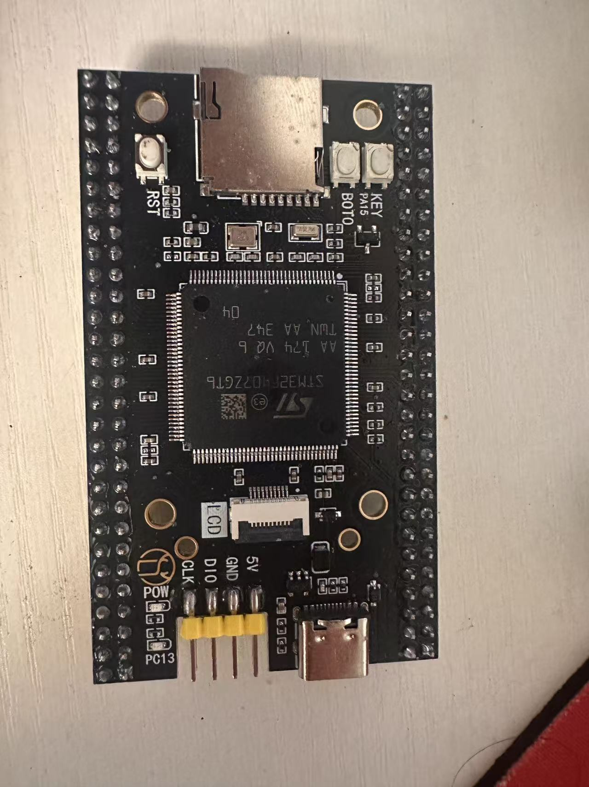
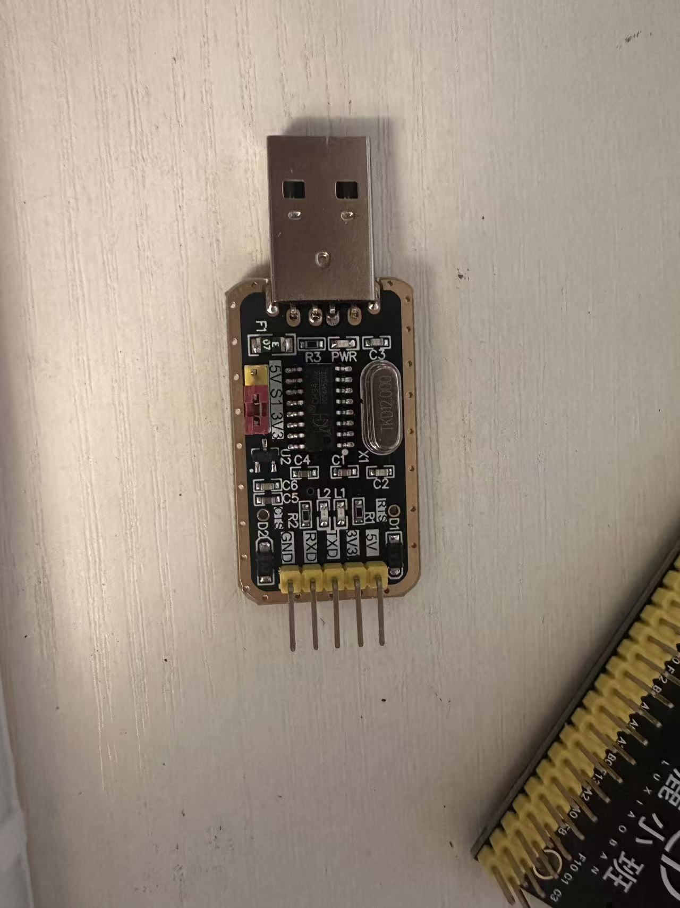
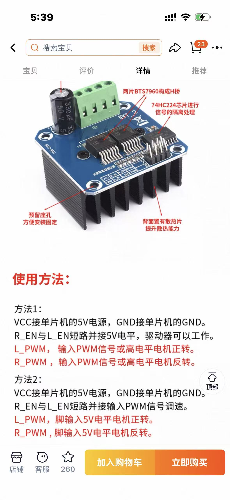

# OpenRobot-One | ROS 2 × STM32 双电机闭环验证

[](https://github.com/qwerty12399/OpenRobot-One/actions/workflows/ros2_build.yml)


OpenRobot-One 是一个 ROS 2 与 STM32 分层验证项目：在 Gazebo 中验证双轮差速、LaserScan、TF 和 SLAM，在真机台架上计划验证两块 BTS7960、两台编码器电机、双速度 PID、UART 和故障停车。两条链路共享 `/cmd_vel`、差速运动学、左右轮命令/反馈语义和测试向量。

当前真机是无轮、架空双电机闭环台架，不宣称落地运动、真实里程计精度或真机自主导航。

[项目成果](docs/project_showcase.md) · [系统架构](docs/architecture.md) · [开发路线](docs/roadmap.md) · [验收标准](docs/acceptance.md)

## 当前状态

| 范围 | 状态 | 证据 |
| --- | --- | --- |
| ROS 2 Humble 工程 | **实际通过** | 本次Docker复验：11个包，88项测试，0错误/失败/跳过 |
| Gazebo + LaserScan + SLAM | **实际通过** | Topic、TF、`/map` 和 `/scan` 运行记录 |
| STM32F407 H2 | **实际通过** | 构建、下载、verify、USART1通信 |
| UART压力与恢复 | **实际通过** | 10000/10000 PING/PONG、20/20复位重连及异常恢复 |
| BTS7960双电机 | **BLOCKED / 未验证** | 安全装备、逻辑阈值、编码器电平和固件未完成 |
| 双编码器/PID/HIL | **未实现** | 不得写入完成指标 |

## 硬件范围

| STM32F407ZGT6 | CH340 | IBT-2/BTS7960卖家资料 |
| --- | --- | --- |
|  |  |  |
| H2已实测 | UART已实测 | 仅用于端子与卖家参数整理，不代表到货验收 |

当前已购范围：STM32F407、ST-Link、CH340、两块IBT-2/BTS7960、两台JGA25-370编码器电机、12V/5A电源、正负极分线端子和线材。

## 统一架构

```text
                         /cmd_vel
                            ↓
                   Differential Kinematics
                    /                      \
          left_target_rpm          right_target_rpm
                    \                      /
                     ROS 2 Serial Driver
                            ↓ UART
                         STM32F407
                     /                  \
                Left PID             Right PID
                   ↓                     ↓
              BTS7960 L             BTS7960 R
                   ↓                     ↓
                Motor L               Motor R
                   ↑                     ↑
              Encoder L             Encoder R
                     \                 /
                      wheel feedback
                            ↓
                 /bench/odom_estimate
```

Gazebo使用相同的 `/cmd_vel` 和轮系语义验证完整双轮机器人；台架使用真实左右电机反馈。架空估算不发布真机TF，也不替代标准 `/odom`。

## 已纠正的接线冲突

- USART1继续使用 `PA9/PA10`，不改到PA2/PA3。
- 四路PWM候选为 `PB6–PB9 / TIM4_CH1–CH4`。
- 双编码器候选为 `PA0/PA1 / TIM2` 和 `PA6/PA7 / TIM3`。
- 四个EN候选为 `PC0–PC3`，各外接约10kΩ下拉并由固件控制。
- 禁止把 `R_EN/L_EN` 永久接5V。
- 商品页称3.3V兼容，但5V供电74HC244的实际阈值仍需逐块测量。

详见 [硬件事实](docs/hardware_facts.md) 和 [双电机设计](docs/superpowers/specs/2026-09-01-bts7960-dual-motor-bench-design.md)。

## 快速复现仿真

```bash
docker build -f docker/Dockerfile -t openrobot-one:humble .
docker compose -f docker/compose.yaml run --rm dev
./scripts/build_ros.sh
./scripts/run_sim.sh --rviz
```

另一个终端：

```bash
source /workspace/install/setup.bash
./scripts/check_topics.sh
./scripts/check_slam.sh
```

## H2 UART复验

保持两块BTS7960和电机动力完全断开：

```powershell
.\scripts\test_h2_uart.ps1 -Port COM4 -PingCount 10000 -ReconnectCount 20 `
  -ProgrammerCli 'C:\path\to\STM32_Programmer_CLI.exe'
```

## 真机下一步

1. 完成H0/H1装备、电气和逻辑阈值实测。
2. 无动力实现并验证四PWM、四EN、双编码器和统一安全停车。
3. 左右逐通道脉冲，之后才进入双电机PID。
4. H4通过后实现ROS 2串口闭环和 `/bench/odom_estimate`。

在H0/H1通过前禁止动力上电和任何非零命令。

本次转向的文件、清理范围和验证结果见 [BTS7960双电机转向验证记录](docs/verification/2026-09-01-bts7960-dual-motor-transition.md)。

## 工程结构

```text
OpenRobot-One/
├── docker/                     # Ubuntu 22.04 + ROS 2 Humble
├── docs/                       # 架构、协议、验收和证据
├── firmware/openrobot_firmware # 当前H2 STM32基线
├── ros2_ws/src/                # ROS 2仿真和预留驱动包
├── scripts/                    # 构建、仿真与H2验收
└── 硬件参数图片/               # 实物与卖家资料原图
```

## License

Apache License 2.0，详见 [LICENSE](LICENSE)。
