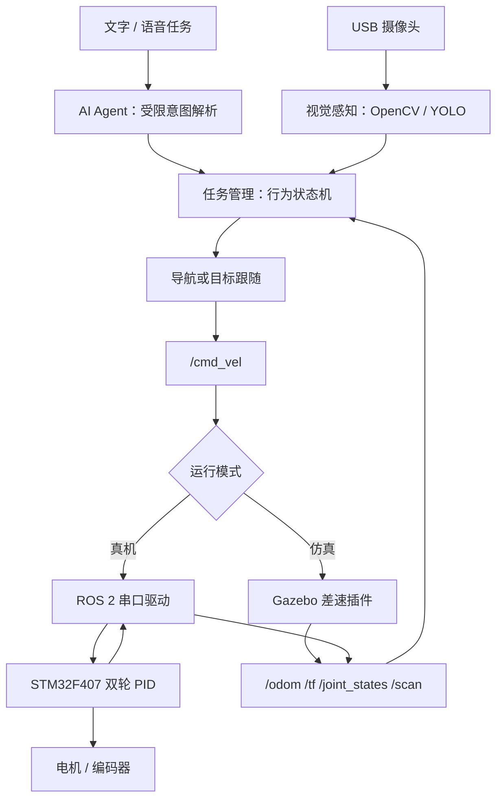

# OpenRobot-One AI Lite

基于 ROS 2、STM32 和视觉智能的低成本具身智能移动机器人平台。项目目标不是做一辆只能遥控的“小车”，而是建立从自然语言任务、环境感知、行为决策到底盘实时控制的完整工程闭环。

> 当前状态：仿真、二维激光建图和统一参数底座已完成；视觉、任务管理、LLM、真机串口驱动和 STM32 电机闭环仍处于工程骨架或待实现阶段。本文不会把规划能力标记为已完成。

## 系统闭环



AI 与视觉在上位机运行，STM32 只承担 PWM、编码器采集、PID、通信看门狗和安全停车等实时任务。云端模型不得直接输出 PWM，也不得绕过本地状态机。

## 已完成与待实现

| 模块 | 状态 | 说明 |
| --- | --- | --- |
| ROS 2 Humble + Docker + CI | 已完成 | Ubuntu 22.04、colcon、ament lint 基线 |
| 参数化机器人模型 | 已完成 | URDF/Xacro、RViz、统一几何参数 |
| Gazebo 差速仿真 | 已完成 | `/cmd_vel`、`/odom`、`/joint_states`、TF |
| LaserScan + SLAM Toolbox | 已完成 | 办公室世界与同步建图入口 |
| STM32 板级基线 | H2 已通过 | F407ZGT6 下载/校验、PC13 状态、USART1 10000/10000 往返与 20/20 复位重连已实测；电机引脚未冻结 |
| 真机串口驱动与双轮 PID | 待实现 | 参数、协议和安全门已定义 |
| USB 摄像头与目标检测 | 待实现 | 包边界和接口已定义 |
| 任务管理与 AI Agent | 待实现 | 先规则状态机，后接受限 LLM |
| 语音交互 | 路线规划 | 稳定文字入口优先，语音后接入 |

## 工程结构

```text
OpenRobot-One/
├── .github/workflows/          # ROS 2 构建与测试
├── docker/                     # Ubuntu 22.04 + ROS 2 Humble 环境
├── docs/                       # 架构、BOM、环境、协议、路线与验收
├── firmware/openrobot_firmware # STM32CubeIDE 板级基线
├── ros2_ws/src/
│   ├── openrobot_description   # URDF/Xacro、RViz、机器人内部 TF
│   ├── openrobot_gazebo        # Gazebo 世界与仿真入口
│   ├── openrobot_navigation    # SLAM，后续 AMCL/Nav2
│   ├── openrobot_driver        # STM32 串口、里程计、诊断
│   ├── openrobot_control       # 运动约束与底盘控制协调
│   ├── openrobot_vision        # 摄像头、OpenCV、YOLO
│   ├── openrobot_ai            # 语言任务解析与受限 Agent
│   ├── openrobot_task          # 搜索/跟随行为状态机
│   ├── openrobot_msgs          # 必要的自定义消息
│   ├── openrobot_bringup       # 仿真/真机组合启动
│   └── openrobot_tests         # 仓库级结构与验收测试
└── scripts/                    # 构建、运行与检查入口
```

## 环境要求

- Ubuntu 22.04（原生或 Windows 11 + WSL2）
- ROS 2 Humble、Gazebo Classic 11、RViz2
- C++17、Python 3、colcon、ament_cmake / ament_python
- Docker Engine 或 Docker Desktop + Compose v2
- 真机阶段：STM32CubeIDE、ST-Link、USB-TTL 和独立限流电源
- 视觉阶段：支持 UVC 的 USB 摄像头；YOLO 权重不提交到 Git
- AI 阶段：本地规则模式无需 API；启用云端模型时通过环境变量注入密钥

完整安装要求见 [环境配置需求](docs/environment.md)，硬件选型见 [硬件清单](docs/hardware_bom.md)。

## 快速开始

在 WSL/Ubuntu 的仓库根目录构建并进入开发容器：

```bash
docker build -f docker/Dockerfile -t openrobot-one:humble .
docker compose -f docker/compose.yaml run --rm dev
```

在容器内构建并测试：

```bash
./scripts/build_ros.sh
```

启动办公室仿真与 SLAM：

```bash
./scripts/run_sim.sh
```

使用 `./scripts/run_sim.sh --rviz` 打开 Gazebo 客户端和 RViz，使用 `--no-slam` 仅验证底盘运动。

## 当前验收

仿真运行后，在另一个容器终端执行：

```bash
source /workspace/install/setup.bash
./scripts/check_topics.sh
./scripts/check_slam.sh
```

预期存在 `/scan`、`/odom`、`/joint_states`，以及唯一的 `odom → base_footprint`、`base_footprint → base_link`、`base_link → laser_link`；启用 SLAM 时还应存在 `/map` 和唯一的 `map → odom`。

真机、视觉和 AI 的分阶段验收门见 [功能验收标准](docs/acceptance.md)。在编码器计数、轮径、轮距、电机方向和驱动电流能力未实测前，禁止输出非零电机命令。

## 文档导航

- [项目架构](docs/architecture.md)
- [环境配置需求](docs/environment.md)
- [硬件清单与采购优先级](docs/hardware_bom.md)
- [ROS 2 接口与串口协议](docs/protocol.md)
- [开发路线](docs/roadmap.md)
- [功能验收标准](docs/acceptance.md)
- [已确认硬件事实](docs/hardware_facts.md)

## 硬件基线说明

当前主控为已核验的 `STM32F407ZGT6`。电机驱动方案已更新为两块 DRV8871、每块独立驱动一台电机；仓库已归档模块版型图和芯片实物近照，确认 `IN1/IN2/VM/GND`、`OUT1/OUT2` 与 DRV8871 芯片，但 ILIM 精确阻值、持续电流和散热能力仍待实测。旧 TB6612FNG 只作为历史备件记录。

## License

Apache License 2.0，详见 [LICENSE](LICENSE)。
