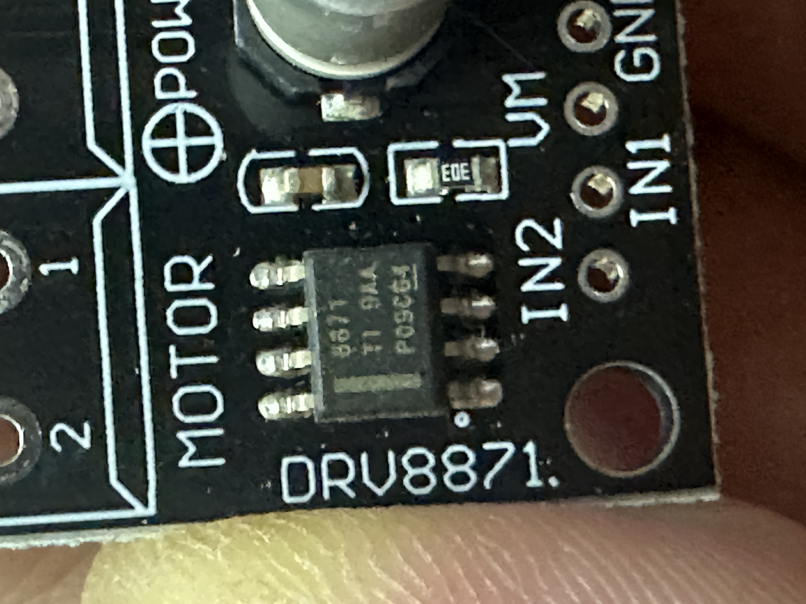
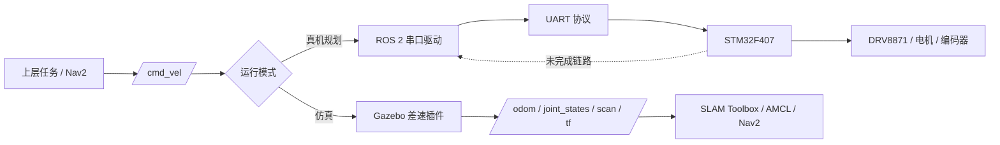

# OpenRobot-One | ROS 2 × STM32 移动机器人集成与验证

[](https://github.com/qwerty12399/OpenRobot-One/actions/workflows/ros2_build.yml)


[](LICENSE)

OpenRobot-One 是一个低成本双轮差速机器人项目，围绕 **ROS 2 仿真与导航、STM32 板级验证、软硬件接口、安全门和工程交付** 建立可复现的项目闭环。

这个仓库重点展示的不是尚未完成的功能数量，而是如何把需求拆成阶段、统一接口、验证关键链路、定位异常并留下可交接的证据。

**适配岗位：** 技术支持 / FAE / 售后支持 · 项目交付 / 实施 · 机器人系统 / 硬件测试 · 售前 / 技术销售

[查看成果与验证证据](docs/project_showcase.md) · [查看项目架构](docs/architecture.md) · [查看验收标准](docs/acceptance.md) · [快速复现](#快速复现)

## 核心成果

| 成果 | 验证状态 | 可核验证据 |
| --- | --- | --- |
| ROS 2 Humble 工程基线 | **实际通过** | Docker 环境中 11 个包完成构建，87 项测试 0 error / 0 failure / 0 skipped；[验证记录](docs/verification/2026-09-01-project-validation.md#ros-2-构建与测试) |
| Gazebo + LaserScan + SLAM | **实际通过** | `/scan`、`/odom`、`/joint_states`、`/map` 和目标 TF 链实测存在，`/scan` 平均 9.990 Hz；[运行验收](docs/verification/2026-09-01-project-validation.md#gazebo-与-slam) |
| STM32F407 板级基线 | **H2 实际通过** | 固件构建、下载、逐字节 verify、寄存器检查和 USART1 双向通信通过；[板级报告](docs/verification/2026-08-31-h2-board-bringup.md) |
| UART 压力与异常恢复 | **实际通过** | `10000/10000` PING/PONG、`20/20` 复位重连，以及错误帧、超长帧、半包和错误波特率恢复；[测试脚本](scripts/test_h2_uart.ps1) |
| TF 与接口所有权 | **实际通过（仿真）** | `map → odom → base_footprint → base_link → laser_link` 发布职责已定义并交叉验证；[架构说明](docs/architecture.md#4-tf-唯一发布者) |
| 电机、编码器和真机闭环 | **未验证 / 禁止外推** | H0/H1 电气安全门仍未通过，不宣称 PID、真机 `/odom` 或超时停车完成；[当前限制](docs/project_showcase.md#当前限制与安全边界) |

> 验证状态只采用三类：**实际通过**、**静态检查**、**未验证**。旧报告或规划不能替代当前实测证据。

## 多岗位能力映射

| 岗位方向 | 项目中体现的能力 | 证据入口 |
| --- | --- | --- |
| 技术支持 / FAE / 售后 | 复现问题、串口联调、异常恢复、风险隔离、编写客户可执行步骤 | [H2 板级验证](docs/verification/2026-08-31-h2-board-bringup.md)、[UART 测试脚本](scripts/test_h2_uart.ps1) |
| 项目交付 / 实施 | 需求拆解、阶段门、统一接口、验收清单、风险与文档管理 | [验收标准](docs/acceptance.md)、[项目路线](docs/roadmap.md)、[环境说明](docs/environment.md) |
| 机器人系统 / 硬件测试 | 自动化测试、边界输入、Launch/Topic/TF 检查、软硬件集成验证 | [闭环验证记录](docs/verification/2026-09-01-project-validation.md)、[仓库测试](ros2_ws/src/openrobot_tests/test) |
| 售前 / 技术销售 | 架构讲解、方案选型、约束说明、完成度与预期管理 | [系统架构](docs/architecture.md)、[硬件 BOM](docs/hardware_bom.md)、[硬件事实](docs/hardware_facts.md) |

更完整的职责、排障案例和证据索引见 [项目成果与验证证据](docs/project_showcase.md)。

## 实物与硬件范围

| STM32F407ZGT6 主控 | CH340 USB-TTL | DRV8871 实物近照 |
| --- | --- | --- |
|  |  |  |
| H2 下载、运行和 UART 验证载体 | USART1 115200 8N1 通信链路 | 已确认芯片与端子；限流和持续电流仍待实测 |

图片用于说明已核对的实物范围，不代表电机已经通电或真机闭环已经完成。

## 系统架构



- **仿真轨已验证：** Gazebo → LaserScan → SLAM Toolbox，并复用 ROS 2 标准接口。
- **真机轨当前到 H2：** PC 测试脚本 → CH340 → USART1 → STM32F407 已验证。
- **真机运动仍受安全门约束：** DRV8871、电机、编码器、PID 和真机里程计未完成验收。
- 视觉、任务管理和受限 LLM 保留为后续模块，不作为当前完成成果。

## 典型问题定位

| 现象 | 处理过程 | 结果 |
| --- | --- | --- |
| ST-Link 可枚举但无法读取 Core ID | 分离供电、复位和 SWD 链路，使用 connect-under-reset，复核实际针脚与接触 | 最终读取 Device ID `0x413`、1 MiB Flash 和 Cortex-M4；[过程记录](docs/verification/2026-08-31-h2-board-bringup.md) |
| UART 半包、错误波特率或异常输入后可能影响后续通信 | 增加 500 ms 半包清理、错误状态复位、边界输入和恢复测试 | 完整 PING/PONG 可恢复，错误输入返回 `H2-ERR`；[验证记录](docs/verification/2026-09-01-project-validation.md#已解决的通信风险) |
| 链接器提示 Flash 段为 `RWE` | 增加显式程序头并用 `readelf` 复核段权限 | Flash 为 `R E`，RAM 为 `RW`，重新下载及回归通过；[ELF 证据](docs/verification/2026-09-01-project-validation.md#elf-段权限) |

## 技术栈

- Ubuntu 22.04、ROS 2 Humble、Gazebo Classic 11、RViz2、SLAM Toolbox
- C++17、Python 3、colcon、ament_cmake / ament_python
- STM32F407ZGT6、STM32CubeIDE / CubeMX / CubeProgrammer、HAL、ST-Link、CH340
- Docker、GitHub Actions、pytest / ament lint、PowerShell 硬件验收脚本

## 快速复现

环境：Ubuntu 22.04，或 Windows 11 + WSL2 / Docker Desktop。

```bash
docker build -f docker/Dockerfile -t openrobot-one:humble .
docker compose -f docker/compose.yaml run --rm dev
```

在容器内构建并测试：

```bash
./scripts/build_ros.sh
```

启动 Gazebo 与 SLAM：

```bash
./scripts/run_sim.sh --rviz
```

在另一终端验收 Topic、TF 和 SLAM：

```bash
source /workspace/install/setup.bash
./scripts/check_topics.sh
./scripts/check_slam.sh
```

STM32 H2 重复验收需要真实开发板、ST-Link 和 CH340：

```powershell
.\scripts\test_h2_uart.ps1 `
  -Port COM4 `
  -PingCount 10000 `
  -ReconnectCount 20 `
  -ProgrammerCli 'C:\path\to\STM32_Programmer_CLI.exe'
```

## 工程结构

```text
OpenRobot-One/
├── .github/workflows/          # ROS 2 构建与测试
├── docker/                     # Ubuntu 22.04 + ROS 2 Humble 环境
├── docs/                       # 架构、协议、BOM、验收和证据
├── firmware/openrobot_firmware # STM32CubeIDE H2 板级基线
├── ros2_ws/src/                # 11 个 ROS 2 功能包
├── scripts/                    # 构建、运行和验收入口
└── tools/                      # 项目文档生成工具
```

## 当前边界与下一步

- H0/H1 电气安全门仍为 `BLOCKED`：缺少独立电压、连通性、电机电流、限流和保险丝实测。
- 在安全门通过前，禁止电机通电和非零控制命令。
- 下一阶段先完成电气事实核验，再冻结 DRV8871、编码器和定时器引脚，进入 H3 架空低速运动。
- 真实仿真录屏和整车演示将在对应验收完成后补充，不使用效果图代替实测。

详见 [功能验收标准](docs/acceptance.md)、[硬件事实](docs/hardware_facts.md)和[项目路线](docs/roadmap.md)。

## License

Apache License 2.0，详见 [LICENSE](LICENSE)。
