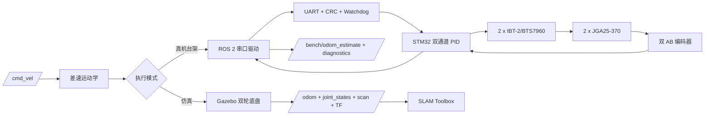

# OpenRobot-One 分层验证架构

## 总体架构

仿真和真机不是两个无关项目：两者共享 `/cmd_vel`、差速公式、轮系参数版本、左右轮命令/反馈语义和参考向量。仿真验证系统级导航接口，真机验证真实执行与安全链路。

## 当前完成状态

| 层 | 状态 | 证据 |
| --- | --- | --- |
| ROS 2/Gazebo/SLAM | 实际通过 | 构建、Topic、TF、LaserScan和SLAM报告 |
| STM32 H2/UART | 实际通过 | 下载、verify、压力、异常恢复和重连 |
| BTS7960双电机 | 未验证 | H0/H1仍未通过 |
| 双编码器/PID | 未验证 | 固件尚未实现 |
| ROS 2真机台架 | 未验证 | driver仍是安全占位 |

## TF所有权

仿真模式：

- SLAM Toolbox或AMCL二选一发布 `map -> odom`；
- Gazebo差速插件发布 `odom -> base_footprint`；
- `robot_state_publisher`发布机器人内部TF。

真机架空台架：

- 不发布 `map -> odom`；
- 不发布 `odom -> base_footprint`；
- `/bench/odom_estimate`只作为数据，不广播TF。

## 参数所有权

- 轮径、轮距、限速、方向和通信参数必须版本化。
- 仿真值与实测值分别标注来源。
- 编码器计数为0或UNKNOWN时禁止非零真机命令。
- Topic通过参数或remapping配置，不在源码硬编码。

## 固件责任

- 上电、复位、Fault和超时默认禁用两块驱动；
- 四个EN独立控制并具有外部下拉；
- 100Hz双速度环、计数/RPM计算和输出限幅；
- 500ms运动命令看门狗独立于传输心跳；
- UART状态、故障和序号可追踪。

## 当前范围外

落地底盘、真实里程计精度、真机SLAM/Nav2、视觉、任务AI、micro-ROS和`ros2_control`不属于当前完成标准。
