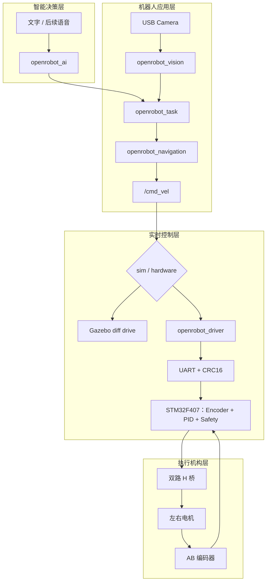

# OpenRobot-One AI Lite 系统架构

## 1. 设计原则

系统分为智能决策、机器人应用、实时控制和执行机构四层。上位机处理非实时的语言、视觉、任务与导航；STM32 处理确定性的双轮闭环和故障停车。仿真与真机共享标准 ROS 2 接口，不让上层依赖具体执行端。



## 2. 包职责

| 包 | 当前状态 | 单一职责 |
| --- | --- | --- |
| `openrobot_description` | 已实现 | Xacro、RViz、机器人内部 TF |
| `openrobot_gazebo` | 已实现 | 仿真世界、差速/雷达插件、实体生成 |
| `openrobot_navigation` | SLAM 已实现 | SLAM Toolbox，后续 AMCL/Nav2 |
| `openrobot_driver` | 骨架 | UART、协议、运动学、里程计、诊断、重连 |
| `openrobot_control` | 骨架 | 速度限制与底盘控制协调，不与固件 PID 重复 |
| `openrobot_vision` | 骨架 | 摄像头、OpenCV、YOLO、目标观测 |
| `openrobot_ai` | 骨架 | 语言到白名单任务意图，不直接控制 PWM |
| `openrobot_task` | 骨架 | 搜索、对准、接近、停止状态机 |
| `openrobot_msgs` | 保留 | 标准消息不足时再添加稳定接口 |
| `openrobot_bringup` | 已实现 | 组合启动并选择仿真或真机所有者 |
| `openrobot_tests` | 已实现 | 仓库结构、脚本与跨包验收 |

骨架包只声明边界，不代表节点功能已经实现。

## 3. 运行链路

### 3.1 仿真轨

```text
/cmd_vel → Gazebo diff drive → /odom + odom→base_footprint
Gazebo ray sensor → /scan → SLAM Toolbox → /map + map→odom
robot_state_publisher → base_footprint→base_link 与机器人内部 TF
```

### 3.2 真机轨

```text
/cmd_vel → openrobot_driver → 左右目标轮速 → UART → STM32
STM32 → 双电机 PID → PWM/H桥 → 电机 → 编码器
STM32 状态 → UART → openrobot_driver → /odom + odom→base_footprint
robot_state_publisher → base_footprint→base_link 与机器人内部 TF
```

仿真和真机底盘所有者不可同时启动。

### 3.3 AI 目标搜索轨

```text
用户文本 → openrobot_ai → 结构化任务
USB Camera → openrobot_vision → 目标观测
任务 + 观测 → openrobot_task → 搜索/对准/接近/停止
状态机输出 → /cmd_vel → 当前底盘执行端
```

第一版先支持文字和确定性规则；语音与云端 LLM 是可替换输入，不改变底盘安全边界。

## 4. TF 唯一发布者

| 变换 | 仿真模式 | 真机模式 |
| --- | --- | --- |
| `map → odom` | SLAM Toolbox 或 AMCL 二选一 | SLAM Toolbox 或 AMCL 二选一 |
| `odom → base_footprint` | Gazebo 差速插件 | `openrobot_driver` |
| `base_footprint → base_link` | `robot_state_publisher` | `robot_state_publisher` |
| 车体固定/关节关系 | `robot_state_publisher` | `robot_state_publisher` |

目标 TF 树：

```text
map
└── odom
    └── base_footprint
        └── base_link
            ├── left_wheel_link
            ├── right_wheel_link
            └── laser_link
```

视觉相机挂载后新增 `camera_link` 固定关系，仍由 `robot_state_publisher` 发布。不得新增第二个节点发布同一条变换。

## 5. 参数所有权

- 机器人几何、速度限制和通信基线：`openrobot_bringup/config/robot.yaml`。
- 仿真插件参数：`openrobot_gazebo/config/sim.yaml`。
- SLAM 参数：`openrobot_navigation/config/slam_params.yaml`。
- 后续视觉、任务、AI 和驱动参数分别归属对应包的 `config/`，再由 Bringup 组合。
- Topic 名通过 ROS 参数、Launch 参数或 remapping 配置。
- 串口设备、波特率、超时、协议版本和轮系实测值不得硬编码。

`encoder_counts_per_wheel_rev: 0` 表示尚未标定，真机驱动和固件必须把它视为禁止非零输出的无效值。

## 6. 安全边界

1. STM32 在启动、协议错误、串口超时、传感器故障或看门狗复位后保持 PWM 为零。
2. ROS 驱动在上游 `/cmd_vel` 超时后持续发送零速。
3. LLM 只生成白名单任务，不生成 PWM、串口字节或任意代码。
4. 摄像头故障、检测过期或目标不确定时，任务管理器停车而不是盲目接近。
5. 电机首次上电必须架空、限流、带保险丝并有人值守。

## 7. 设计范围

AI Lite MVP 包含双轮差速底盘、编码器闭环、USB 摄像头、目标检测、文字任务、目标搜索和 ROS 2 标准接口。micro-ROS、`ros2_control`、机械臂、多机器人、端到端视觉控制和无约束自主 Agent 不在当前范围。
