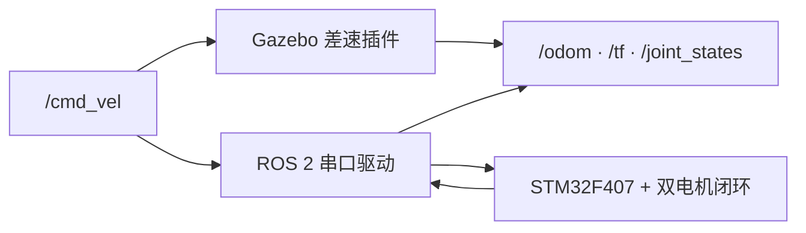

# OpenRobot-One 架构

## 双轨边界

仿真轨和真机轨不同时拥有底盘里程计 TF。上层只依赖统一 ROS 2 接口，不依赖具体执行端。

## 包职责

- `openrobot_description`：Xacro、模型参数、RViz 和机器人内部 TF。
- `openrobot_bringup`：组合子包 Launch，选择仿真或真机模式。
- `openrobot_gazebo`：世界、Gazebo 插件、生成机器人和仿真入口。
- `openrobot_navigation`：后续 SLAM Toolbox、AMCL 和 Nav2 配置。
- `openrobot_driver`：后续串口、运动学、里程计、诊断和重连。
- `openrobot_msgs`：仅在标准消息无法表达实际需求时添加接口。
- `openrobot_tests`：包结构、运动学、协议和集成验收。

Day 1–2 建立这些边界与构建入口。Day 3 在
`openrobot_description` 中实现参数化模型；Day 4 在
`openrobot_gazebo` 中组合标准 Gazebo 插件，并由
`openrobot_bringup` 选择仿真或预留真机入口。Day 5–7 增加 CPU ray
雷达、本地办公室世界和独立的 SLAM Toolbox 建图入口。

## TF 唯一发布者

| 变换 | 仿真模式 | 真机模式 |
| --- | --- | --- |
| `map → odom` | SLAM Toolbox 或 AMCL | 首月不实现真机导航 |
| `odom → base_footprint` | Gazebo 差速插件 | ROS 2 真机驱动 |
| `base_footprint → base_link` | `robot_state_publisher` | `robot_state_publisher` |
| 底盘内部关节/固定关系 | `robot_state_publisher` | `robot_state_publisher` |

同一模式中不允许两个节点发布同一条 TF。

### Day 4 仿真所有权

- `gazebo_ros_diff_drive`：订阅 `/cmd_vel`，发布 `/odom` 和
  `odom → base_footprint`。
- `gazebo_ros_joint_state_publisher`：只发布左右轮
  `/joint_states`。
- `robot_state_publisher`：发布
  `base_footprint → base_link` 及底盘内部关系。
- Day 4 不存在 `map → odom`，也不发布 `/scan`。

### Day 5–7 建图所有权

- `gazebo_ros_ray_sensor`：发布 `/scan`，Frame 为 `laser_link`。
- `slam_toolbox`：建图时独占 `map → odom` 并发布 `/map`。
- `gazebo_ros_diff_drive`：继续独占 `odom → base_footprint`。
- `robot_state_publisher`：继续独占机器人内部 TF。
- `run_sim.sh` 和 `run_slam.sh` 分开启动，避免重复启动 Gazebo。

## 参数与采购映射

| 软件参数 | 当前来源 | 后续校准依据 |
| --- | --- | --- |
| `wheel_radius` | 仿真工程估计值 | 实际驱动轮有效滚动半径 |
| `wheel_separation` | 仿真工程估计值 | 左右轮接地点中心距 |
| `encoder_cpr` | 尚未定义 | JGA25-370 编码器线数、倍频和减速比 |
| 电机输出上限 | 尚未定义 | 电机额定/堵转电流与 TB6612FNG 能力 |
| 串口设备与波特率 | 尚未定义 | CH340 映射和固件协议 |

采购清单没有明确驱动轮与支撑轮规格，因此 Day 3 模型尺寸只能保持参数化，不能被当作真机定值。
